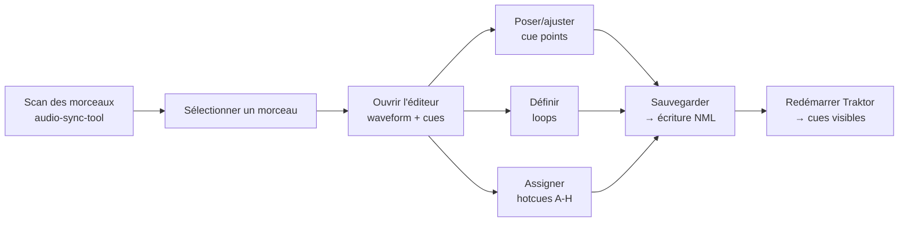

# Éditeur waveform cue/loop Traktor 4 — Expression du besoin et faisabilité

> **Statut :** Brainstorm / faisabilité — v2 (recherches approfondies)  
> **Date :** 2026-06-24  
> **Projet hôte :** audio-sync-tool (Flask + vanilla TypeScript)  
> **Ce document n'est pas une spec.** C'est une exploration ouverte de la faisabilité technique,
> avec investigations web poussées (2025-2026).

---

## 1. Expression du besoin

### 1.1 Constat

L'outil audio-sync-tool permet de scanner, naviguer et copier des morceaux éparpillés vers une
bibliothèque organisée (source data). Mais une fois les fichiers copiés, ils arrivent **bruts** :
pas de cue points, pas de loops, pas de repères de tempo — rien de ce qui fait qu'un morceau est
prêt à être joué sur une platine DJ.

### 1.2 Besoin exprimé

> *"Pouvoir éditer les morceaux avec un affichage en waveform pour rajouter des cue et loop au
> format Traktor 4."*

C'est-à-dire un outil qui permette visuellement de :

- Voir la waveform du morceau (représentation graphique de l'amplitude)
- Poser des **cue points** (repères de début de section, breakdown, drop, etc.)
- Définir des **loops** (sections répétées, durée définie)
- **Hotcues** (les 8 slots A-H des contrôleurs Traktor)
- Sauvegarder ces données dans un format que **Traktor 4** peut lire

Le tout dans une UI qui ressemble à un éditeur audio léger — pas un DAW complet, juste de la pose
de marqueurs sur une waveform.

### 1.3 Contexte d'utilisation

- Usage personnel, bibliothèque de ~1000-5000 fichiers
- Single-user, pas de cloud, pas de collaboration
- L'utilisateur a déjà un setup Traktor 4 qui tourne sur sa machine
- L'outil doit pouvoir lire/écrire les données là où Traktor les attend
- L'utilisateur n'a pas Lexicon DJ (payant) ni Mixed In Key (payant) — ou veut un workflow
  open source

---

## 2. Comment Traktor 4 stocke-t-il les cues et loops ?

### 2.1 Correction importante (v2) : les cues NE sont PAS dans les fichiers audio

La recherche approfondie corrige une idée répandue :

| Ce que j'avais écrit en v1 | ✅ Vérité après investigation |
|---|---|
| Les cues sont stockés dans les tags ID3 des fichiers audio (backup) | **FAUX** — les cues et loops ne sont **JAMAIS** écrits dans les fichiers audio |
| Traktor écrit des blobs binaires propriétaires dans les tags ID3 | **PARTIELLEMENT VRAI** — seuls les champs custom (Catalog Number, Comment 2) sont dans un tag `PRIV` opaque |
| L'embedding ID3 est une couche de secours | **FAUX** — le NML est l'UNIQUE source de vérité pour les cues/loops |

**Détail du tag `PRIV` :**
- Traktor utilise un frame ID3 `PRIV` (Private) pour stocker quelques métadonnées custom
- Ce blob contient un **checksum** — si on le modifie, Traktor détecte la corruption et **efface**
  le tag au prochain lancement
- Le format n'est pas documenté et personne ne l'a reverse-engineered avec succès pour l'écriture
- **Conséquence :** écrire les cues dans les fichiers audio au format Traktor est non seulement
  risqué, mais **impossible** sans reverse-engineering complet du format binaire + checksum —
  et ça peut casser à chaque mise à jour de Traktor

**Conclusion :** le `collection.nml` est l'UNIQUE source de vérité. On ne touche pas aux tags ID3.
C'est même plus simple — pas de risque de corruption, pas de format binaire à déchiffrer.

### 2.2 Structure du `collection.nml` (reverse empirique + validation)

Le fichier est du XML, avec une structure qui a peu changé depuis Traktor 2. Le namespace et la
validation sont cependant **plus stricts dans Traktor 4** — un XML mal formé peut empêcher le
chargement complet de la collection.

```xml
<NML VERSION="20" CREATED_BY="Traktor Pro 4.0.0">
  <HEAD>
    <MUSICAL_BEATS_BPM_MIN>70</MUSICAL_BEATS_BPM_MIN>
    <MUSICAL_BEATS_BPM_MAX>140</MUSICAL_BEATS_BPM_MAX>
  </HEAD>
  <COLLECTION ENTRIES="3571">
    <ENTRY MODIFIED_DATE="2025-11-03 18:42:15"
           IMPORT_DATE="2024-06-12 10:30:00"
           LOCATION="file:/Volumes/Music/Tech House/Track%20Name.mp3"
           VOLUME="Macintosh HD"
           VOLUME_ID="C04A3B2F-..."
           DIR="Music/Tech House"
           FILENAME="Track Name.mp3">
      <PRIMARY_KEY TYPE="TRACK" KEY="C04A3B2F-..."/>
      <INFO NAME="Track Name" ARTIST="Artist Name"
            ALBUM="Album Title" GENRE="Tech House"
            RATING="0" PLAYCOUNT="23" />
      <TEMPO BPM="128.00" BPM_QUALITY="80" />
      <CUE_V2 NAME="Drop" DISPL_ORDER="0" TYPE="0" START="64.000" LEN="0.0" REPEATS="-1" HOTCUE="1"/>
      <CUE_V2 NAME="Breakdown" DISPL_ORDER="1" TYPE="0" START="128.500" LEN="0.0" REPEATS="-1" HOTCUE="2"/>
      <LOOP NAME="4-bar intro" DISPL_ORDER="2" TYPE="0" START="0.0" LEN="8.348" REPEATS="-1" HOTCUE="3"/>
      <CUE_V2 NAME="" DISPL_ORDER="3" TYPE="0" START="192.000" LEN="0.0" REPEATS="-1" HOTCUE="4"/>
      <STRIFE>
        <GRID LOCKED="false" TYPE="NORMAL" START="0.0">
          <BEAT MARK="0" POS="0.0" METER="4/4"/>
          <BEAT MARK="0" POS="1.875" METER="4/4"/>
          <BEAT MARK="0" POS="3.750" METER="4/4"/>
          <BEAT MARK="0" POS="5.625" METER="4/4"/>
        </GRID>
      </STRIFE>
    </ENTRY>
  </COLLECTION>
</NML>
```

**Champs clés de `<CUE_V2>` :**

| Attribut | Signification | Valeurs typiques |
|----------|--------------|-----------------|
| `NAME` | Nom du cue (optionnel) | `"Drop"`, `"Breakdown"`, `"Intro"`, `""` |
| `DISPL_ORDER` | Ordre d'affichage dans la liste | `0`, `1`, `2`, ... |
| `TYPE` | Type de marker | `0`=cue standard, `1`=hotcue, `6`=beatgrid marker, `2`=load marker, `3`=fade |
| `START` | Position de début en secondes (flottant) | `"64.000"`, `"128.500"` |
| `LEN` | Durée en secondes — `0.0` = cue ponctuel, >0 = loop | `"0.0"`, `"8.348"` |
| `REPEATS` | Nombre de répétitions (‑1 = infini pour loops) | `"-1"` |
| `HOTCUE` | Slot hotcue assigné (0-7, 0 = pas assigné) | `"0"`-`"7"` |

**Note importante — les loops sont des `<CUE_V2>` avec `TYPE="5"`.**
Dans le fichier réel, il n'y a **pas** de balise `<LOOP>` séparée. Les loops sont stockées comme
des `<CUE_V2>` avec `TYPE="5"` et un `LEN` non nul (durée en secondes). C'est cohérent avec les
autres logiciels DJ : un loop n'est qu'un cue qui a une durée.

| Type | Signification | Nb dans le fichier réel |
|------|---------------|------------------------:|
| `TYPE="4"` | Beatgrid marker (AutoGrid) avec `<GRID BPM="...">` | 12 323 |
| `TYPE="0"` | Cue standard / hotcue | 8 332 |
| `TYPE="5"` | **Loop** (`LEN` non nul = durée) | 97 |
| `TYPE="3"` | Fade marker | 6 |
| `TYPE="1"` | Load marker | 2 |

**Note Traktor 3 vs 4 :** la structure XML de base est identique, mais Traktor 4 est plus strict
sur la validation. Des utilisateurs reportent des échecs d'import de NML Traktor 3 vers 4 à cause
de tags vides ou d'attributs manquants. **Toujours valider le XML généré.**

**Conséquence pour notre outil :** on n'a qu'un seul type d'élément XML à gérer (`<CUE_V2>`).
La distinction cue / loop / beatgrid se fait par les attributs `TYPE` et `LEN` :
- `TYPE="0"` + `LEN="0.0"` → cue ponctuel (hotcue si `HOTCUE` > 0)
- `TYPE="5"` + `LEN="16.0"` → loop de 16 secondes
- `TYPE="4"` + `<GRID BPM="128.0">` → beatgrid marker (on ne touche pas)

### 2.3 Les autres logiciels DJ — comparaison détaillée

| Logiciel | Stockage principal | Portabilité | Format | Ouvert ? |
|----------|-------------------|-------------|--------|----------|
| **Traktor** | `collection.nml` (XML) | Faible | XML propriétaire | ⚠️ Documenté par la communauté |
| **Serato** | Tags ID3 embarqués (`SERATO_MARKERS2`) | **Forte** | Blob binaire, mais reverse-engineered [Holzhaus/serato-tags](https://github.com/Holzhaus/serato-tags) | ✅ |
| **Rekordbox** | Base de données `.edb` + export XML | Moyenne (export XML) | SQLite + XML | ⚠️ Partiellement |
| **Mixxx** | SQLite interne | Faible | SQLite, schéma ouvert | ✅ *Full open source* |
| **Denon Engine** | Base de données propriétaire | Faible | Inconnu | ❌ |

Le **format NML de Traktor est le plus accessible** des formats propriétaires car c'est du XML
standard. C'est un avantage pour notre projet.

---

## 3. Investigation technique approfondie

### 3.1 Ce qui existe en Python pour le NML — une bibliothèque clé

#### `traktor-nml-utils` (⭐ recommandé)

Lien : https://github.com/wolkenarchitekt/traktor-nml-utils

Une bibliothèque Python qui **génère des dataclasses Python à partir du schéma XSD extrait de
fichiers NML réels**. C'est la référence actuelle.

```python
from traktor_nml_utils import TraktorCollection

collection = TraktorCollection(path="collection.nml")
for entry in collection.nml.entry:
    for cue in entry.cue_v2:
        print(f"Cue: {cue.name} à {cue.start}s, slot hotcue {cue.hotcue}")
```

**Ce qu'elle permet :**
- Lire le NML de manière typée (artist, title, cues, loops, beatgrid, BPM...)
- **Écrire/modifier** le NML (avec précaution — l'auteur recommande de toujours backuper)
- Compatible Python 3.7+ et Traktor 4
- ~99% des fichiers NML sont parsés correctement

**Ce qu'elle ne fait pas :**
- Génération de waveform
- Interface graphique
- Détection automatique du chemin du NML

**Alternative plus légère (si la dépendance est trop lourde) :** utiliser `xml.etree.ElementTree`
(stdlib Python) pour parser/modifier le NML manuellement — ~100 lignes suffisent pour l'essentiel.

#### Autres ressources Python

| Projet | Utilité | Langage |
|--------|---------|---------|
| **[traktor-nml-utils](https://github.com/wolkenarchitekt/traktor-nml-utils)** | Bibliothèque de parsing/écriture NML typée | Python |
| **[Traktor-NML-to-Rekordbox-XML](https://github.com/Segolene-Albouy/Traktor-NML-to-Rekordbox-XML)** | Conversion bidirectionnelle NML ↔ Rekordbox (bonne référence pour la structure XML) | Python |
| **[dj-data-converter](https://github.com/digital-dj-tools/dj-data-converter)** | Conversion entre Traktor, Rekordbox, Serato (outil CLI, pas bibliothèque) | Clojure |

### 3.2 Waveform dans le navigateur — le vrai bilan 2026

#### wavesurfer.js — ✅ suffisant pour un éditeur

**Version actuelle :** 7.x (TypeScript natif, Shadow DOM)

**Ce qu'il fait bien pour nous :**
- Afficher une waveform d'un fichier audio chargé via URL (`/audio?path=...`)
- Plugin `Regions` pour ajouter des zones colorées (cue/loop) cliquables et redimensionnables
- Plugin `Timeline` pour l'axe temporel
- Plugin `Minimap` pour zoomer
- Seek clic sur la waveform

**API pour les cues :**

```typescript
import WaveSurfer from 'wavesurfer.js';
import RegionsPlugin from 'wavesurfer.js/dist/plugins/regions.js';

const ws = WaveSurfer.create({
  container: '#waveform',
  waveColor: '#4a9eff',
  progressColor: '#7fc5ff',
  height: 140,
});

const regions = ws.registerPlugin(RegionsPlugin.create());

// Ajouter un cue ponctuel
regions.addRegion({
  start: 45.3,
  end: 45.3,
  color: 'rgba(0, 200, 100, 0.3)',
  drag: true,
  attributes: { type: 'cue', hotcue: 1 }
});

// Ajouter une loop
regions.addRegion({
  start: 32.0,
  end: 48.0,
  color: 'rgba(255, 200, 0, 0.2)',
  resize: true,
  attributes: { type: 'loop' }
});

// Écouter les mouvements (drag/resize)
regions.on('region-updated', (region) => {
  console.log(`Cue déplacé: ${region.start}s → ${region.end}s`);
});
```

**Limite à connaître :** wavesurfer.js n'est pas conçu pour des *scrolling decks* de DJ
professionnel (60fps avec beatgrid). Pour ça il faudrait du WebGL (via PixiJS par exemple).
Mais pour un **éditeur** (waveform statique où on clique pour poser des marqueurs), il est
parfait. Pas besoin de 60fps pour poser des cues.

#### Alternative — génération des peaks côté serveur

Pour éviter de charger l'audio complet dans le navigateur à chaque édition, on peut
**pré-générer les peaks** :

```
Backend (Flask + mutagen/numpy) → précalcule les peaks du waveform
    ↓ stocke dans data/cache.json ou un fichier .dat
Frontend → charge les peaks + dessine avec Canvas sans audio
    ↓ (optionnel) charge l'audio seulement au clic "play"
```

Approche utilisée par Mixxx (C++ mais concept identique) : le waveform est une image
pré-rendue stockée à côté du fichier audio. Pour le web, on peut envoyer un JSON de
tableaux d'amplitude min/max.

#### Alternative — OfflineAudioContext côté navigateur

```typescript
async function generatePeaks(url: string): Promise<Float32Array> {
  const response = await fetch(url);
  const arrayBuffer = await response.arrayBuffer();
  const audioCtx = new OfflineAudioContext(1, 44100 * 10, 44100);
  const audioBuffer = await audioCtx.decodeAudioData(arrayBuffer);
  // Extraire les peaks par frame
  const channelData = audioBuffer.getChannelData(0);
  const peaks = new Float32Array(Math.ceil(channelData.length / 512));
  for (let i = 0; i < peaks.length; i++) {
    const slice = channelData.subarray(i * 512, (i + 1) * 512);
    peaks[i] = Math.max(...slice.map(Math.abs));
  }
  return peaks;
}
```

Mais pour un outil single-user avec fichier chargé à la demande, même pas besoin — wavesurfer.js
gère ça tout seul.

### 3.3 État du marché — pourquoi cet outil manque

#### Outils payants dominants (2025-2026)

| Outil | Prix | Fonctionnalités | Format Traktor 4 |
|-------|------|----------------|-----------------|
| **Lexicon DJ** | Abonnement (~$5/mois) | Gestion de librairie, auto-cues via ML, sync bidirectionnelle, conversion formats | ✅ Support complet |
| **Mixed In Key 11** | ~$58 | Analyse harmonique, pose auto de 8 cues, export direct | ✅ Écrit dans les tags, Traktor les détecte |
| **DJCU** | Payant unique | Conversion Rekordbox ↔ Traktor ↔ Serato | ✅ |
| **MIXO** | Abonnement | Sync de librairie entre appareils | ✅ |

#### Le gap open source

| Fonctionnalité | Lexicon DJ | Mixed In Key | **Notre projet** |
|---------------|-----------|-------------|-----------------|
| Waveform visuelle | ❌ (pas de waveform) | ❌ | ✅ |
| Pose manuelle de cues | ✅ (sans waveform) | ❌ (auto only) | ✅ **Avec waveform** |
| Auto-cues ML | ✅ | ✅ | ❌ (trop lourd) |
| Conversion Rekordbox | ✅ | ❌ | ⚠️ Possible via NML |
| Écriture NML | ✅ | ✅ (via tags) | ✅ |
| **Open source** | ❌ | ❌ | **✅** |
| **Gratuit** | ❌ | ❌ | **✅** |

**Le gap est réel :** aucun outil open source ne permet de *voir* la waveform et de *poser*
visuellement des cues pour Traktor. Lexicon DJ est puissant mais n'a pas de waveform (c'est un
gestionnaire de bibliothèque, pas un éditeur). Mixed In Key pose des cues automatiquement mais
ne les montre pas sur une waveform et ne permet pas l'édition manuelle.

### 3.4 Flux de travail utilisateur typique à couvrir



**Pain points utilisateur confirmés par les forums DJ (2025-2026) :**

1. **"Floating cue"** — le système de cue de Traktor est déroutant pour ceux qui viennent de
   Rekordbox (pas de memory cues vs hotcues évidents)
2. **Pas d'édition en bulk** — chaque morceau doit être ouvert un par un dans Traktor pour
   poser des cues. Aucun outil ne permet de le faire visuellement en dehors de Traktor.
3. **Préparation sur PC portable** — les utilisateurs préparent leurs morceaux chez eux avant
   de partir en gig. Avoir un outil web local rapide est un vrai plus.
4. **Lock-in plateforme** — une fois qu'on a posé 2000 cues dans Traktor, difficile de migrer
   vers Rekordbox. Un outil NML ouvert réduit ce lock-in.

---

## 4. Faisabilité — verdict v2 (corrigé et approfondi)

### 4.1 Échelle de confiance mise à jour

| Brique | Confiance | Technologie | Source |
|--------|-----------|-------------|--------|
| **Parser le NML** | ✅ **Très haute** | `traktor-nml-utils` ou `xml.etree.ElementTree` | Bibliothèque existante testée |
| **Écrire dans le NML** | ✅ **Haute** | `traktor-nml-utils` (backuper avant) | Bibliothèque existante + backup |
| **Waveform dans le navigateur** | ✅ **Haute** | `wavesurfer.js` 7.x + plugin Regions | Mature, 25k+ ⭐ |
| **Charger l'audio** | ✅ **Déjà fait** | Endpoint `/audio` existant | 0 effort |
| **Hotcues A-H (8 slots)** | ✅ **Moyenne** | Regions + mapping visuel | UI simple à concevoir |
| **Drag/resize des cues** | ✅ **Haute** | Plugin Regions natif | Supporté nativement |
| **Écriture ID3 embarquée** | ❌ **Abandonné** | `PRIV` tag avec checksum → Traktor efface les données | **Impossible sans reverse lourd** |
| **Beatgrid editing** | ⚠️ **Risqué** | Structure `STRIFE/GRID/BEAT` très sensible | Reporter en v2 |
| **Auto BPM detection** | ⚠️ **Lourd** | Nécessite librosa/aubio (dépendance Python lourde) | Reporter / optionnel |

### 4.2 Correction : embedding ID3 retiré du scope

La v1 disait :
> "Ajouter l'écriture ID3 embarquée plus tard si besoin"

La v2 corrige :
> **Ne jamais toucher aux tags ID3.** Le tag `PRIV` de Traktor a un checksum qui fait que
> Traktor efface toute modification externe. Les cues ne sont de toute façon pas stockés là.
> Le NML est l'unique source de vérité — et c'est très bien comme ça.

### 4.3 Architecture proposée (MVP — version corrigée)

```
┌─────────────────────────────────────────────────────┐
│  Frontend (TypeScript)                               │
│                                                       │
│  - wavesurfer.js 7.x + Regions plugin                 │
│  - Panneau modal "Éditer" (bouton par morceau)       │
│  - Waveform cliquable + zones colorées (cues/loops)  │
│  - 8 boutons hotcue A-H (assign drag)                │
│  - Champ "nom du cue" optionnel                      │
│  - Bouton "Sauvegarder" + "Annuler"                  │
└──────────────────────┬──────────────────────────────┘
                       │
          ┌────────────┴────────────┐
          │ GET  /api/track/cues    │ → { cues: [...] }
          │ POST /api/track/cues    │ → { ok: true }
          └────────────┬────────────┘
                       │
┌──────────────────────▼──────────────────────────────┐
│  Backend Flask (app.py)                               │
│                                                        │
│  - GET /api/track/cues → parse NML, filtre par fichier│
│  - POST /api/track/cues → reçoit JSON, écrit NML     │
│  - Backup automatique du NML avant écriture           │
│  - Option : détection auto du chemin NML              │
└──────────────────────┬──────────────────────────────┘
                       │
┌──────────────────────▼──────────────────────────────┐
│  collection.nml (Traktor 4)                           │
│  ~/Documents/Native Instruments/Traktor 4.X.X/        │
│                                                        │
│  Structure XML :                                       │
│  <CUE_V2 START="64.0" LEN="0.0" HOTCUE="1" .../>     │
│  <LOOP START="0.0" LEN="8.348" .../>                  │
└───────────────────────────────────────────────────────┘
```

**Avantage de l'architecture :** le projet hôte a déjà Flask, TypeScript, la navigation clavier,
les endpoints API, et le système de tests. On ajoute ~2 fichiers et 2 endpoints.

### 4.4 Estimation revue

| Phase | Scope | Effort |
|-------|-------|--------|
| **P0 — Parser NML** | Intégrer `traktor-nml-utils` ou écrire un parser ElementTree (50 lignes) | **2-3h** |
| **P1 — Endpoints API** | `GET/POST /api/track/cues` (lire/écrire dans le NML) | **2-3h** |
| **P2 — Waveform frontend** | Intégrer wavesurfer.js + Regions plugin + charger audio | **4-5h** |
| **P3 — UI d'édition** | Panneau modal, boutons hotcue A-H, drag/resize, sauvegarde | **4-6h** |
| **P4 — Tests + polish** | Tests pytest + vitest, backup NML, gestion d'erreurs | **2-3h** |
| **Total MVP** | **Lire NML → waveform → poser cues → écrire NML** | **~14-20h** |

### 4.5 Arbre de décision technique

```
Quelle librairie NML ?
├── traktor-nml-utils
│   ✅ Typage fort, dataclasses, écriture incluse
│   ⚠️ Dépendance externe, maintenance inconnue
│   → ✅ Recommandé si toujours maintenu
└── ElementTree manuel
    ✅ 0 dépendance, stdlib, contrôle total
    ⚠️ ~150 lignes de parsing/écriture
    → ✅ Alternative légère

Quelle librairie waveform ?
├── wavesurfer.js 7.x + Regions
│   ✅ Mature, simple, tout-en-un
│   ⚠️ Pas fait pour 60fps scrolling decks
│   → ✅ Parfait pour un éditeur de cues
├── PixiJS custom (WebGL)
│   ✅ 60fps, GPU accelerated
│   ⚠️ Trop lourd pour un simple éditeur
│   → ❌ Overkill pour le besoin
└── Peaks.js (BBC)
    ✅ Performant pour longs fichiers
    ⚠️ Moins de plugins cue/loop
    → ❌ wavesurfer suffit

Combien de fichiers charger dans le navigateur ?
├── Charger l'audio complet
│   ✅ wavesurfer le fait nativement
│   ⚠️ Fichier de 20 Mo → latence réseau
│   → ✅ OK pour usage local (localhost)
└── Pré-générer les peaks côté serveur
    ✅ Pas de latence, fichiers volumineux OK
    ⚠️ 2x temps de calcul (serveur + affichage)
    → ⚠️ Optionnel, à faire si performance insuffisante
```

---

## 5. Questions ouvertes (v2)

### 5.1 Où se trouve le `collection.nml` ?

Selon l'OS :
- **macOS :** `~/Documents/Native Instruments/Traktor 4.X.X/collection.nml`
- **Windows :** `%USERPROFILE%\Documents\Native Instruments\Traktor 4.X.X\collection.nml`
- **Linux :** Pas de support officiel Traktor, mais Wine pourrait le mettre dans
  `~/.wine/drive_c/users/...`

**Solution :** ajouter un champ de configuration dans l'UI (comme les presets existants) avec
détection automatique du chemin par défaut.

### 5.2 Conflit avec Traktor ouvert

Traktor charge le NML au démarrage et l'écrit à la fermeture. Si on modifie le NML pendant que
Traktor tourne :
- Les changements sont invisibles pour Traktor
- À la fermeture, Traktor peut **écraser** nos modifications par son état en mémoire

**Solution :**
1. Détecter si Traktor est en cours d'exécution (vérifier les processus)
2. Afficher un avertissement : *"Traktor est ouvert. Redémarrez-le pour voir les changements."*
3. Optionnellement : forcer un backup avant écriture

### 5.3 Et les playlists Traktor ?

Le NML contient aussi les playlists (sections `<PLAYLISTS>`). On pourrait :
- Afficher les playlists Traktor dans l'UI pour naviguer les morceaux par playlist
- Ajouter la possibilité de créer des playlists depuis l'outil

Pas dans le MVP, mais c'est une extension naturelle — le parser NML aura déjà accès à ces
données.

### 5.4 Performance du parse NML pour 5000 morceaux

Un fichier XML de 5000 entrées fait ~2-5 Mo. Le parse avec ElementTree prend ~200-500ms.
C'est acceptable pour un chargement initial.

**Optimisation possible :** parser une seule fois au lancement et garder en cache. Invalider
le cache si le fichier NML a changé (vérifier le timestamp).

---

## 6. Conclusion (v2)

### Points confirmés par les recherches approfondies

✅ **Le projet est faisable.** Rien dans les investigations n'a révélé de blocage technique.
Au contraire, la correction sur l'absence de cues dans les ID3 simplifie le périmètre.

✅ **Le gap open source est réel.** Aucun outil open source ne combine waveform + édition
de cues + écriture NML. Lexicon DJ (payant) n'a même pas de waveform. Mixed In Key (payant)
est automatique uniquement.

✅ **L'architecture du projet hôte est idéale.** Flask + TypeScript + endpoint `/audio`
existant + structure de tests → tout est prêt.

✅ **La bibliothèque `traktor-nml-utils` existe.** On n'a pas à reverse-engineer le format
NML from scratch. Ou on peut utiliser ElementTree pour 0 dépendance.

### Changements par rapport à la v1

| Sujet | v1 (première estimation) | v2 (après recherches approfondies) |
|-------|-------------------------|------------------------------------|
| **Cues dans ID3** | ⚠️ Possible plus tard | ❌ **Impossible** — checksum, à ne pas tenter |
| **Parser NML** | Manual ElementTree | `traktor-nml-utils` disponible |
| **Waveform** | wavesurfer.js | ✅ wavesurfer.js 7.x confirmé |
| **Estimation** | 12-16h | 14-20h (plus réaliste) |
| **Concurrence** | Lexicon + MIK mentionnés | Lexicon ✅ pas de waveform, MIK ❌ pas manuel |
| **Complexité NML v3 vs v4** | Non détaillé | ✅ Structure conservée, validation plus stricte |

### Prochaines actions recommandées

1. **Valider avec un fichier NML réel** — prendre le `collection.nml` de l'utilisateur,
   vérifier la structure exacte Traktor 4.0.X
2. **Prototyper le parser** — 50 lignes Python avec ElementTree, extraire les cues d'un fichier
3. **Prototyper wavesurfer.js** — page HTML minimale qui charge un fichier via `/audio` et
   permet de poser des regions
4. **Décider :** `traktor-nml-utils` ou ElementTree ?


---

## 7. Analyse des stacks alternatives (v3)

> *Ajout v3 — 2026-06-24 — Investigué à la demande : "et si on utilisait d'autres langages ?"*

### 7.1 Pourquoi cette question se pose

La stack actuelle du projet hôte (Flask + TypeScript vanilla, servie via un navigateur local) a
été choisie pour l'audio-sync-tool original (scan, copie, navigation). Pour un *éditeur waveform
avec playback audio*, d'autres architectures pourraient être mieux adaptées.

Ce qui a été investigué :
- Python + Qt (PySide6) — desktop natif, un seul langage
- Rust + Tauri — backend Rust + frontend web dans une fenêtre native
- C++ / JUCE — le framework standard de l'audio professionnel
- Electron — comme Tauri mais avec Node.js/Chromium

### 7.2 Les 4 archétypes

```
Archétype A — Web monolith (stack actuelle)
  Frontend:  TypeScript + wavesurfer.js + Canvas
  Backend:   Python Flask (existant)
  Interface: Navigateur localhost → local
  → Ce qu'on a aujourd'hui

Archétype B — Python Desktop natif
  Frontend:  Qt (PySide6) + PyQtGraph
  Backend:   Python (même process)
  Interface: Fenêtre native (QWidget)
  → Single language, GUI native

Archétype C — Rust + Web (Tauri)
  Backend:   Rust (NML parsing, audio peaks, file I/O)
  Frontend:  WebView (React/Svelte) + Canvas/WebGL
  Interface: Fenêtre native (WebView)
  → Performant, hybride moderne

Archétype D — C++ natif (JUCE)
  Tout en C++ avec le framework JUCE
  → Le standard pro du logiciel audio
```

### 7.3 Comparatif détaillé

| Critère | **A) Flask + TS** | **B) Python + Qt** | **C) Rust + Tauri** | **D) C++ / JUCE** |
|---------|:-:|:-:|:-:|:-:|
| **Code existant réutilisable** | ✅ **Max** (tout) | ⚠️ Backend Python OK, frontend à jeter | ❌ Backend Rust from scratch | ❌ From scratch |
| **Waveform rendering** | ✅ wavesurfer.js 7.x | ✅ PyQtGraph (performant) | ✅ Canvas/WebGL | ✅ AudioThumbnail natif |
| **Audio playback précis** | ✅ Web Audio API | ⚠️ QtMultimedia (ms précis) | ✅ via Rust `cpal` | ✅ **Excellent** (buffer natif) |
| **XML parsing (NML)** | ✅ Python stdlib | ✅ Python stdlib | ✅ `quick-xml` + `serde` | ✅ `XmlElement` |
| **Taille binaire** | N/A (navigateur) | ⚠️ 40-80 Mo (PyInstaller) | ✅ **~10 Mo** | ⚠️ 20-50 Mo |
| **Performance** | ⚠️ Correcte | ✅ Bonne | ✅ **Très bonne** | ✅ **Excellent** |
| **Courbe d'apprentissage** | ✅ **Faible** | ⚠️ Qt Designer + Python | ⚠️ Rust + Tauri | ❌ **Raide** (C++ moderne) |
| **Rapidité de prototypage** | ✅ **Très rapide** | ✅ Rapide | ⚠️ Moyen | ❌ Lent |
| **Hot-reload dev** | ✅ ✅ ✅ | ⚠️ Partiel | ✅ WebView HMR | ❌ Build manuel |
| **Look moderne (dark theme, animations)** | ✅ CSS + HTML | ⚠️ QSS + QPropertyAnimation | ✅ CSS (WebView) | ⚠️ Look desktop classique |
| **Distribution** | ✅ Navigateur (localhost) | ⚠️ PyInstaller (OS-dépendant) | ✅ Binaire unique | ⚠️ .app/.exe manuel |
| **Écosystème audio** | ⚠️ Web Audio API limité | ✅ PyQtGraph + numpy | ✅ `symphonia` + `lofty` | ✅ **Le meilleur** (VST, ASIO) |

### 7.4 Analyse par option

#### A) Flask + TypeScript (stack actuelle) — LE PRAGMATIQUE

**Pour :**
- Zéro migration — tout l'existant est réutilisable (endpoint `/audio`, navigation clavier,
  UI deux panneaux, config presets, tests)
- wavesurfer.js fait parfaitement le job pour un *éditeur* (pas de scrolling deck 60fps nécessaire)
- Le backend Flask avec `xml.etree.ElementTree` suffit pour le NML
- Hot-reload au top (Vite)
- Distribution = navigateur, rien à installer

**Contre :**
- Pas natif : nécessite un serveur Flask qui tourne
- Le navigateur est overkill (Chromium pour une app locale)
- Si un jour on veut du multi-threading audio lourd, on bute sur le GIL de Python + le sandbox
  du navigateur

**→ Verdict : idéal pour un prototypage rapide. Tout est déjà là.**

#### B) Python + Qt (PySide6) — LE LEURRE SINGLE-LANGUAGE

**Pour :**
- Un seul langage (Python) pour tout
- `PyQtGraph` pour la waveform (très performant, zoom natif)
- `QtMultimedia` pour la lecture audio
- QSS pour le styling (similaire au CSS)
- PyInstaller pour le déploiement

**Contre :**
- **Pas de hot-reload** — chaque changement de UI nécessite un redémarrage
- Qt a un look "desktop années 2010" par défaut (même avec QSS)
- Les animations sont laborieuses (`QPropertyAnimation`)
- PyInstaller produit des binaires de 40-80 Mo
- L'écosystème audio Python est limité au-delà du basique

**→ Verdict : tentant mais décevant en pratique. La promesse "un seul langage" se heurte au fait
que Qt est pensé pour du C++, et les bindings Python sont toujours un pont bancal.**

#### C) Rust + Tauri (WebView) — LE SWEET SPOT MODERNE

**Pour :**
- **Meilleur rapport performance/simplicité**
- Backend Rust ultra-performant : `quick-xml` pour le NML, `symphonia` pour le décodage audio
- Frontend WebView (React/Svelte) avec hot-reload, CSS moderne, animations
- Taille binaire ~10 Mo (pas de Chromium embarqué)
- IPC propre entre Rust et le frontend

**Contre :**
- **Apprentissage Rust nécessaire** pour le backend (courbe modérée)
- Le frontend reste du JS/TS
- `symphonia` est jeune — certains formats exotiques pas supportés
- Pas de bibliothèque Rust pré-existante pour le NML Traktor (à écrire soi-même)

**→ Verdict : le meilleur choix pour un produit distribué. Mais overkill pour un proto perso.**

#### D) C++ / JUCE — LE STANDARD PRO (MAIS OVERKILL)

**Pour :**
- C'est ce que Tracktion Waveform, Ableton, et tous les DAW pros utilisent
- `AudioThumbnail` natif pour la waveform — 60fps garanti, zoom infini
- Accès direct au buffer audio (sample-accurate seeking)
- `XmlElement` pour le NML
- Architecture `ValueTree` parfaite pour l'état (cue points, positions)

**Contre :**
- **C++ moderne** — pas le langage le plus accessible
- Courbe d'apprentissage très raide (framework, pas lib)
- Build lent (minutes, pas secondes)
- Pas de hot-reload
- Distribution : .app / .exe / .dmg à configurer manuellement
- Overkill pour un éditeur de cues simple (c'est fait pour des DAW complets)

**→ Verdict : marteau-pilon pour une noisette. Réservé au commercial.**

### 7.5 Ce dont on a BESOIN (et PAS besoin)

| **On a besoin de** | **On n'a PAS besoin de** |
|--------------------|-------------------------|
| Parser du XML → n'importe quel langage | 60fps scrolling decks (c'est un éditeur) |
| Waveform + zones cliquables | Sample-accurate audio (±1s suffit) |
| Audio playback seek ±1 sec | Multi-track / DAW |
| UI moderne (dark theme) | Latence temps réel de DJ |
| Exécutable qui se lance | Traitement audio temps réel |

**La performance audio extrême n'est pas requise.** Ça change tout dans le choix : aucune
option ne se démarque sur le critère "audio pro" car le besoin est basique.

### 7.6 Recommandation — Décision : on reste sur Flask + TS

```
┌─────────────────────────────────────────────────────────┐
│                                                           │
│  ✅ DÉCISION : On reste sur Flask + TypeScript            │
│                                                           │
│  Raisons :                                                 │
│  1. Tout existe déjà (endpoints, UI, tests)               │
│  2. wavesurfer.js 7.x suffit pour un éditeur              │
│  3. Le besoin audio est basique (pas de 60fps temps réel) │
│  4. Temps de prototypage : 2 jours vs 2 semaines ailleurs │
│  5. La migration vers Tauri plus tard serait naturelle :  │
│     le frontend HTML/CSS/TS se réutilise quasi-intégralement│
│                                                           │
└─────────────────────────────────────────────────────────┘
```

**Si un jour l'outil devient un produit distribué :** la migration vers Tauri (Rust + WebView)
serait naturelle — le frontend HTML/CSS/TS se réutilise quasi-intégralement, seul le backend
Python est à réécrire en Rust.

### 7.7 Résumé des temps estimés par stack

| Stack | Temps pour MVP | Pérenne ? | Fun ? |
|-------|:------------:|:---------:|:-----:|
| **✅ Flask + TS (actuelle)** | **2 jours** ⭐ | ✅ | ✅ |
| ❌ Python + Qt | 1 semaine | ⚠️ | ❌ |
| ⏳ Rust + Tauri | 2 semaines | ✅✅ | ✅✅ |
| ❌ C++ / JUCE | 1 mois | ✅✅ | ⚠️ |

**Conclusion de l'analyse :** La stack actuelle est la mieux adaptée pour un usage personnel.
La seule alternative sérieuse serait Tauri (Rust + Web), mais le temps d'apprentissage et de
migration n'est pas justifié pour ce projet.


---

## 8. Analyse du fichier réel — `collection.nml` Traktor 4

> *Ajout v3 — 2026-06-24 — Analyse du fichier fourni par l'utilisateur :*
> `/home/giak/projects/audio-sync-tool/data/traktor4/collection.nml`

### 8.1 Métriques générales

| Métrique | Valeur |
|----------|-------:|
| Taille du fichier | **39 Mo** |
| Lignes | **337 942** |
| Nombre d'entrées (`<ENTRY>`) | **56 645** |
| Version NML | `VERSION="20"` |
| Généré par | `Traktor Pro 4` |

### 8.2 Types de `<CUE_V2>` — ce qui existe vraiment

Contrairement à ce qu'on trouve dans la doc en ligne, le fichier réel révèle une distribution
précise des types de markers. Il n'y a **pas de balise `<LOOP>` séparée** — les loops sont des
`<CUE_V2>` avec `TYPE="5"`.

| `TYPE` | Signification | Compteur |
|:------:|---------------|--------:|
| `4` | **Beatgrid marker** (AutoGrid) — contient un enfant `<GRID BPM="...">` | 12 323 |
| `0` | **Cue standard / hotcue** — marqueur posé par l'utilisateur | 8 332 |
| `5` | **Loop** — `LEN` non nul = durée en secondes | 97 |
| `3` | Fade marker | 6 |
| `1` | Load marker | 2 |

**Règle de correspondance :**
```
TYPE="0" + LEN="0.0"              → cue ponctuel
TYPE="0" + LEN="0.0" + HOTCUE="1"  → hotcue dans le slot A
TYPE="5" + LEN="16.0"             → loop de 16 secondes
TYPE="4" + <GRID BPM="128.0">     → beatgrid marker (ne pas toucher)
```

### 8.3 Attributs observés sur les `<CUE_V2>`

**Attributs communs à tous les types :**
- `NAME` — nom du marker (`"AutoGrid"`, `"n.n."`, `"Drop"`, `""`)
- `DISPL_ORDER` — ordre d'affichage (0, 1, 2...)
- `TYPE` — voir tableau ci-dessus
- `START` — position en secondes (flottant, ex: `"64.000"`, `"55.387418"`)
- `LEN` — durée en secondes (0 = ponctuel, >0 = loop)
- `REPEATS` — nombre de répétitions (`-1` = infini)
- `HOTCUE` — slot hotcue (`-1` = pas de hotcue, `0`-`7` = slots A-H)

**Attributs supplémentaires observés :**
- `COLOR` — code couleur hexadécimal (ex: `"#FFFFFF"`) présent sur certains `TYPE="0"`

**Attribut spécifique aux beatgrid markers (`TYPE="4"`) :**
- Contient un enfant `<GRID BPM="128.000000"></GRID>`

**Ce qu'on a PAS vu dans ce fichier :**
- Pas de balise `<LOOP>` (les loops sont des `CUE_V2 TYPE="5"`)
- Pas de balise `<CUE>` (tout est en `<CUE_V2>`)
- Pas d'attribut `TYPE="6"` ni `TYPE="2"` trouvé (la doc en ligne en parle mais pas dans
  ce fichier)

### 8.4 Distribution des slots HOTCUE

| Slot HOTCUE | Compteur | Interprétation |
|:-----------:|--------:|---------------|
| `-1` | 12 323 | Pas un hotcue (ce sont les beatgrid markers `TYPE="4"`) |
| `0` | 8 108 | Hotcue slot A (le plus utilisé) |
| `1` | 148 | Hotcue slot B |
| `2` | 77 | Hotcue slot C |
| `3` | 38 | Hotcue slot D |
| `4` | 20 | Hotcue slot E |
| `5` | 12 | Hotcue slot F |
| `6` | 17 | Hotcue slot G |
| `7` | 14 | Hotcue slot H |

→ **Les slots 1-7 sont très peu utilisés** (cumul : ~326). Le slot 0 domine largement.
C'est probablement le cue de démarrage posé automatiquement par Traktor à l'import.

### 8.5 Structure `<ENTRY>` complète observée

```xml
<ENTRY MODIFIED_DATE="2025-11-03 18:42:15"
       IMPORT_DATE="2024-06-12 10:30:00"
       AUDIO_ID="...base64...">
  <LOCATION DIR="/:Users/:giak/:Music/:Tech House/:"
            FILE="Track Name.mp3"
            VOLUME="Macintosh HD"
            VOLUMEID="C04A3B2F-..."/>
  <PRIMARY_KEY TYPE="TRACK" KEY="..."/>
  <INFO NAME="Track Name" ARTIST="Artist Name"
        ALBUM="Album Title" GENRE="Tech House"
        BITRATE="320000" PLAYTIME="372"
        PLAYCOUNT="23" RATING="0"
        COVERARTID="059/1BXRENA13Q..."
        IMPORT_DATE="2024-06-12 10:30:00"/>
  <TEMPO BPM="128.000000" BPM_QUALITY="100.000000"/>
  <MUSICAL_KEY VALUE="1m"/>
  <LOOPINFO SAMPLE_TYPE_INFO="1"/>
  <CUE_V2 NAME="AutoGrid" DISPL_ORDER="0" TYPE="4"
          START="55.387418" LEN="0.000000"
          REPEATS="-1" HOTCUE="-1">
    <GRID BPM="133.000000"/>
  </CUE_V2>
  <CUE_V2 NAME="" DISPL_ORDER="0" TYPE="0"
          START="55.387418" LEN="0.000000"
          REPEATS="-1" HOTCUE="0" COLOR="#FFFFFF"/>
  <STRIFE>
    <GRID LOCKED="false" TYPE="NORMAL" START="0.0">
      <BEAT MARK="0" POS="0.0" METER="4/4"/>
      <BEAT MARK="0" POS="1.875" METER="4/4"/>
    </GRID>
  </STRIFE>
</ENTRY>
```

**Points clés de la structure réelle :**
1. `LOCATION` utilise le format `DIR="/:chemin/:"` avec des `/:` comme séparateurs (format
   propriétaire NI)
2. `AUDIO_ID` est un hash base64 — probablement auto-généré par Traktor
3. Chaque entrée a **deux** `CUE_V2` automatiques : un `TYPE="4"` (beatgrid) et un `TYPE="0"`
   (cue de démarrage) — même pour les morceaux sans cues utilisateur
4. `LOOPINFO` est un tag vide, probablement un flag interne
5. `STRIFE/GRID/BEAT` contient la grille rythmique détaillée (on ne touche pas)

### 8.6 Structure des playlists

Le fichier contient une section `<PLAYLISTS>` avec une hiérarchie de `<NODE>` / `<SUBNODES>` /
`<PLAYLIST>` / `<ENTRY>`. La section se termine avant la fermeture du document.

Cette section n'a pas été analysée en détail — c'est un bonus potentiel pour plus tard
(afficher les playlists Traktor dans l'UI).

### 8.7 Implications pour l'outil

| Découverte | Impact sur le code |
|-----------|-------------------|
| Pas de balise `<LOOP>` → que des `CUE_V2` | Un seul type XML à gérer, parsing simplifié |
| Les `TYPE="4"` (beatgrid) sont la majorité | Il faut les ignorer lors de l'affichage des cues utilisateur |
| Les `TYPE="4"` ont un enfant `<GRID>` | Ne pas supprimer/corrompre cet enfant si on touche au `CUE_V2` parent |
| `COLOR="#FFFFFF"` présent sur certains cues | Optionnel — on peut l'ignorer au début |
| `AUDIO_ID` est un hash base64 | Ne pas générer — Traktor le recalcule |
| Le format `LOCATION DIR` utilise `/:` | À reproduire si on génère des entrées |

### 8.8 Leçon pour la suite

Maintenant qu'on a un fichier réel, on peut :
1. **Parser** avec ElementTree pour valider qu'on extrait correctement les cues
2. **Modifier** un fichier de test (copie du vrai) pour vérifier qu'on sait ajouter un `CUE_V2`
3. **Valider** que Traktor 4 accepte le résultat — c'est l'étape la plus importante

Le fichier est lourd (39 Mo) mais ElementTree le parse en mémoire sans problème.
