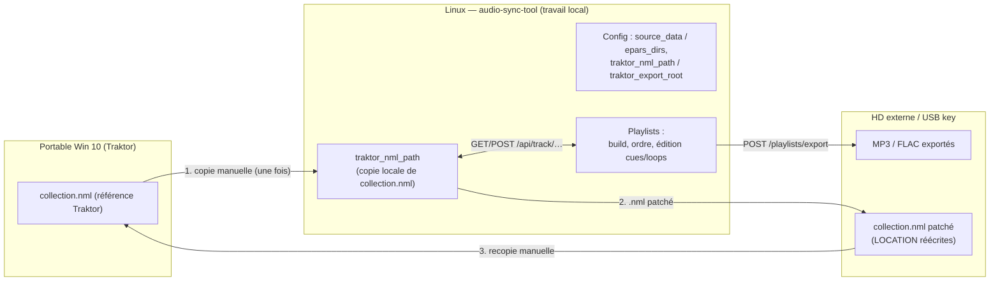
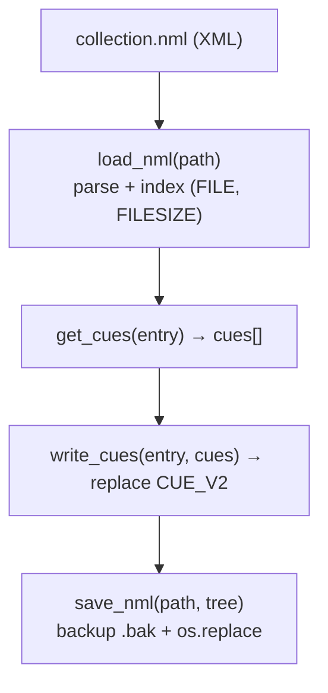
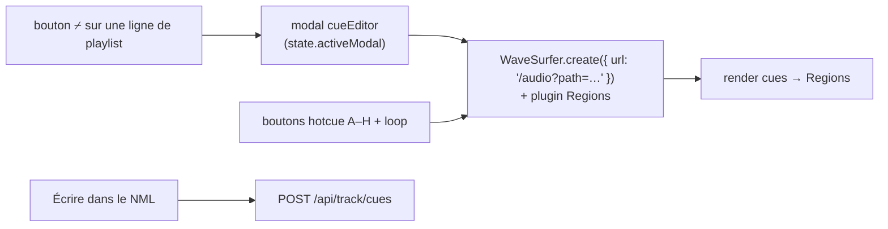

# Éditeur waveform cue/loop — Design (2026-08-07)

**Statut** : Design validé, prêt pour plan d'implémentation
**Sujet** : Éditeur waveform cue/loop pour Traktor 4, basé sur nos playlists, export vers HD externe/USB
**Base** : `docs/superpowers/plans/2026-06-24-waveform-cue-editor-feasibility.md`
**Amendé (2026-08-08)** : audit du vrai `collection.nml` — `docs/superpowers/reports/2026-08-08-nml-audit-real-collection.md`
**Décisions verrouillées en brainstorm** :
- Parser ElementTree maison (pas `traktor-nml-utils` → pas de dépendance GPL).
- Édition sur une **copie locale** du `collection.nml` (jamais le fichier vivant pendant que Traktor tourne).
- Patch de la **collection complète** (une seule source de vérité pendant le travail).
- À l'export : copie MP3/FLAC + `.nml` patché vers le HD externe/USB, avec **réécriture des `LOCATION`** vers la racine d'export.
- Chemins `.nml` et export renseignés en **config** (pas d'auto-détection : Traktor n'est pas sous Linux).

---

## 1. Contexte & workflow

L'app audio-sync-tool (524 tests vitest / 75 pytest) gère des bibliothèques MP3/FLAC locales via des profils
(`source_data`, `epars_dirs`) et des playlists (manifestes JSON). La fonctionnalité manquante : annoter un morceau
d'une playlist en **cue/loop** et **envoyer** ces annotations vers Traktor 4.

Contraintes d'environnement :
- **Traktor tourne exclusivement sur un portable Windows 10** (pas de Traktor sous Linux).
- Tout le travail se fait **100 % local sur Linux** ; le seul artefact qui circule est le **`collection.nml`**.
- L'**export final** (MP3/FLAC + `.nml` patché) cible un **HD externe / USB** défini en config.

Workflow utilisateur :
1. Une fois : copier `collection.nml` du portable vers `traktor_nml_path` (Linux).
2. Construire / ordonner une playlist (fonction existante).
3. Éditer les cues/loops de chaque morceau via l'éditeur waveform (patch de la collection complète).
4. Exporter la playlist : MP3/FLAC + `collection.nml` patché → HD externe/USB, avec `LOCATION` réécrites vers la racine d'export.
5. Ramener le `.nml` sur le portable : Traktor « Importer une autre collection » (éventuellement 1 relocation).

---

## 2. Backend (app.py + module `nml.py`)

### 2.1 Config

Nouveaux champs **optionnels** sur le profil actif de `config.json` :

| Champ | Rôle | Exemple |
|-------|------|---------|
| `traktor_nml_path` | Chemin local du `.nml` de travail (copie) | `/home/user/data/collection.nml` |
| `traktor_export_root` | Racine du HD/USB où sont écrits MP3/FLAC + NML | `/mnt/usb/Traktor/` |
| `traktor_export_volume` | Nom de volume que Traktor verra (pour `VOLUME`/`VOLUMEID`) | `TRAKTOR_USB` |

Non renseigné → éditeur waveform désactivé + bandeau « Config ». Le changement de `source_data`/`epars_dirs`
invalide déjà le cache ; `traktor_nml_path` ne l'invalide **pas** (indépendant).

### 2.2 Module `nml.py` (parser ElementTree maison, ~200 lignes, 0 dépendance)

- `load_nml(path) -> (tree, index)` — parse ElementTree, index sur `(FILE, FILESIZE)` (`LOCATION/FILE` +
  `INFO/FILESIZE`), ignore les chemins (venu de Windows). **Attention** : `FILE` seul a 5 708 doublons ;
  même `FILE+FILESIZE+PLAYTIME` laisse 2 949 clés ambigües (~12 % des pistes) → le sélecteur multi-match
  est le comportement **commun**, pas un edge case.
- `get_cues(entry) -> [Cue]` — les `CUE_V2` avec `{type, start, len, hotcue, name, displ_order}`.
- `write_cues(entry, cues)` — remplace les `CUE_V2` de l'**ENTRY ciblé**, conserve tout le reste de l'arbre
  (`STRIFE`, `LOOPINFO`, `PRIMARY_KEY`, autres `ENTRY`). **Ne jamais reconstruire `DISPL_ORDER` depuis `HOTCUE`**
  (326/8 435 cas divergent dans la collection réelle — l'attribut est conservé tel quel).
- `save_nml(path, tree)` — backup `.bak` unique (écrasé à chaque save) puis écriture atomique
  (`.tmp` puis `os.replace`), en-tête XML personnalisé `standalone="no"` (ET.write ne l'écrit pas), flottants
  sur 6 décimales, indentation à la convenance de l'implémentation (2 espaces ≈ −0,4 % vs original ;
  le round-trip **n'est jamais byte-identique** — seul le contenu/attributs/ordre compte).
- `rewrite_location_for_export(entry, export_root, volume)` — réécrit `DIR`+`VOLUME` (±`VOLUMEID`) vers la racine
  d'export (nom de fichier inchangé).

**Sources de confiance (vérifiées le 2026-08-07)** : format réel §8 de la faisabilité ; 6 décimales et `standalone`,
source `traktor-nml-utils` (`restore_traktor_float_format`). L'écriture ciblée répond au risk du README
« writing NML hasn't been tested thoroughly » en gardant le contrôle total + backup obligatoire.

### 2.3 Endpoints

| Méthode | Route | Détails | Réponses |
|---------|-------|---------|----------|
| `GET` | `/api/nml/status` | chemin depuis la config active | `{configured, path, lastModified}` |
| `GET` | `/api/track/match` | `?path=<mp3>` | `{ok, entries:[{filename, artist, title, cues}], multiple}` |
| `POST` | `/api/track/cues` | `{path, cues:[…]}` | `{ok}` (écriture ciblée + backup) |

Style aligné aux routes existantes (`app.py:441`) : `jsonify`, erreurs HTTP 400/404/500, entrée au journal.

---

## 3. Frontend (wavesurfer.js 7.12.11)

### 3.1 Intégration

- `wavesurfer.js@7.12.11` (dernière stable vérifiée le 17/07/2026 ; v8 encore en beta → **pinner sur 7.x**), bundle **local** (pas de CDN, app 100 % hors-ligne).
- Import `WaveSurfer` + plugin `Regions` (`wavesurfer.js/dist/plugins/regions.js`).

- **Audio** via l'endpoint `/audio` existant (HTTP 206 + Range déjà OK via Flask `conditional`) — **zéro backend neuf** pour l'écoute.
- **Markers** supprimés en v7 → on utilise des `Regions` : point fin pour les cues, étendu pour les loops.
- **Éditées : uniquement les `TYPE ∈ {0,5}` avec `HOTCUE >= 0`** ; les autres sont masqués — `TYPE=4`
  (beatgrid, `LEN` toujours 0), `TYPE=3` (FLIP, 6 cas réels, `HOTCUE` parfois ≥ 0) et `HOTCUE=-1`.
  - cue (`TYPE=0`, `HOTCUE 0..7` = slots A–H) → Region étroite, déplaçable à la souris.
  - loop (`TYPE=5`, `LEN > 0`) → Region étirée, redimensionnable par les deux bords.
- **Positions en secondes** (durée donnée par le player après `ready`).
- **Sauvegarde** : `POST` avec la liste des cues modifiés pour l'ENTRY ciblé, bouton désactivé pendant la requête,
  message ok/erreur dans le modal.

### 3.2 État

- `state.activeModal` accepte `'cueEditor'` + `state.cueEditorTrack` (chemin et entrée sélectionnée éventuelle).
- Composant `render/cueEditor.ts` (pattern Factory des composants existants) ; **pas de pollution de `state.ts`**
  (l'instance wavesurfer vit dans la closure du composant).
- Fermeture (ESC) → la modal est fermée et l'instance wavesurfer est détruite.

---

## 4. Robustesse

| Cas | Comportement |
|-----|--------------|
| `traktor_nml_path` non renseigné | `GET /api/nml/status` → `configured:false` → bandeau + éditeur inactif |
| NML absent ou XML invalide | erreur explicite (indication Expat), entrée journal, pas de crash |
| Fichier audio manquant | `/audio` → 404 (existant) |
| Écriture NML impossible (permissions, disque plein) | HTTP 500 + journal ; **jamais de fichier tronqué** : backup + écriture atomique (`os.replace`) |
| Export sur disque différent | hard link impossible → copy2 (cas `EXDEV` déjà géré `app.py:519`) |
| Traktor ouvert au moment de la recopie | non détectable côté Linux → conseil affiché « fermer Traktor », mention du modal |
| Deux ENTRY avec le même nom de fichier | **fréquent (~12 % des pistes, 5 708 doublons réels)** : `GET` retourne `multiple:true` → sélecteur ARTIST/TITLE + DIR dans le modal, **choix mémorisé** ; jamais d'écriture aveugle en multi-match |

---

## 5. Tests

### pytest (suite style `test_app.py`)

- `nml.py` : fixture multi-entrée (ex. fichier réel §8.5) → `get_cues` filtre `TYPE=4`/`HOTCUE<0` ; round-trip
  parse→save→reparse (attributs/valeurs/ordre identiques ; **pas** de comparaison byte-à-byte, format indentation libre) ;
  `DISPL_ORDER` jamais recalculé ; écriture ciblée : seuls les `CUE_V2` ciblés changent
  (`STRIFE`, `LOOPINFO`, autres `ENTRY` intacts) ; `.bak` créé ; écriture atomique.
- `/api/nml/status` : `configured` true/false.
- `POST /api/track/cues` : 400 (payload invalide), 404 (ENTRY absent), ok + backup.
- Export : `.nml` copié avec `LOCATION` réécrite (DIR/VOLUME).

### vitest (`render/cueEditor.test.ts`)

- Mock `api` → les Regions rendues correspondent aux cues.
- Bouton « A » → region placée à la bonne seconde.
- Sauvegarde → POST correct, bouton désactivé, erreur 500 affichée.
- Homonyme → sélecteur proposé / choix mémorisé.

### Vérification manuelle (en fin)

Sur le vrai `collection.nml` : sélectionner un vrai morceau, placer un cue, sauvegarder, relire dans Traktor
(corrective possible à l'usage).

---

## 7. Hors périmètre (plus tard)

- Peaks pré-calculés côté serveur (audiowaveform / `exportPeaks`) pour très gros FLAC (> 700 Mo).
- Édition du beatgrid (`STRIDE/GRID/BEAT` très sensible — v2).
- Écriture ID3 intégré (avec checksum `PRIV` — Traktor efface ; cf. feasibility §4.2).
- Auto-détection du chemin du NML (Traktor n'est pas sous Linux → inutile).